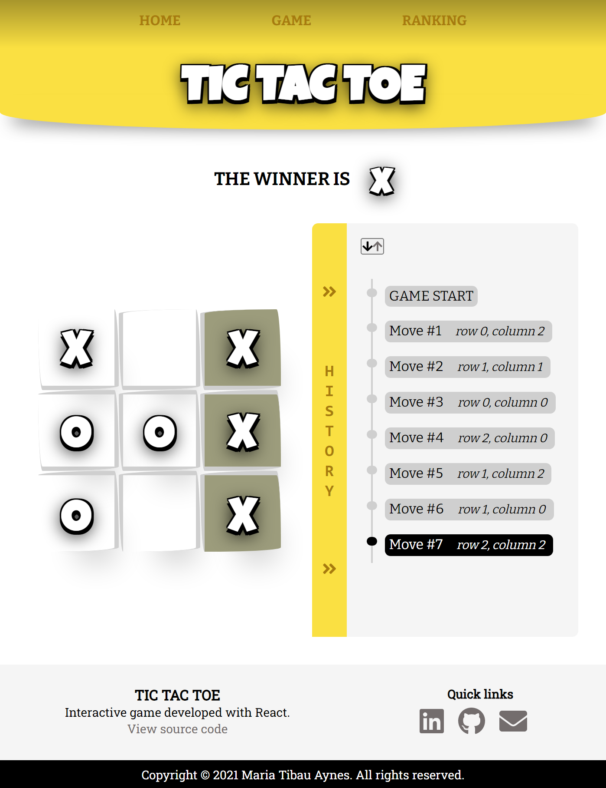

# React TicTacToe

This is a React implementation of Tic Tac Toe game.

## Project Screen Shot(s)

### Web

### Mobile

## Demo 

[Go to Demo!](https://mery25.github.io/tictactoe/)

## Installation and Setup Instructions

### Example:
Clone down this repository. You will need node and npm installed globally on your machine.

### Installation:

npm install

### To Run Test Suite:

npm test

### To Start App:

npm start

### To Visit App:

localhost:3000/react-tictactoe
